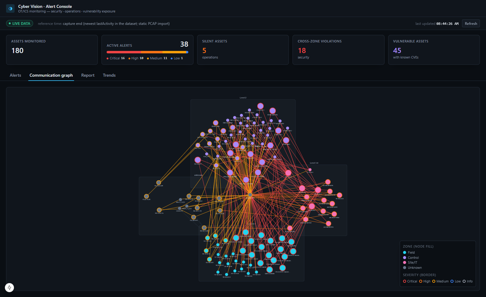
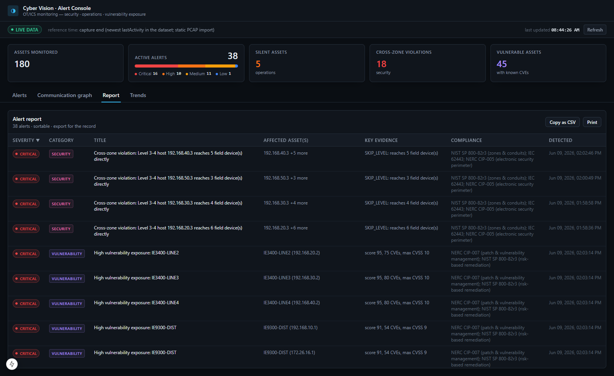

# Cisco Cyber Vision — OT Alert Console (Backend + System of Record)

> A standalone, interactive **alert experience for Cisco Cyber Vision** (OT/ICS network monitoring).
> It pulls data **programmatically from the Cyber Vision Center API**, computes **three new alerts**
> — *Security*, *Operations*, and *Vulnerability exposure* — and visualizes asset-to-asset
> communication as a Purdue-layered graph. Built for an **OT SOC analyst** who must keep an
> industrial network both **safe and running**.

**▶ Live dashboard:** https://cv-alerts-frontend.vercel.app  ·  **API:** https://cv-alerts-backend-1.onrender.com/kpis

> ⏳ **First load takes ~30–60s** (free tiers sleep when idle; the UI shows a "Waking the backend…"
> state and recovers automatically — it is *not* a failure). The public demo runs in **snapshot mode**
> (frozen sample data, no live Center connection) — see [Security](#-security) for why.

This repository is the **system of record**: the FastAPI backend, the alert engine, the authored
policy, the tests, **and all written documentation**. The UI lives in
**[cv-alerts-frontend](https://github.com/pyhrishi/cv-alerts-frontend)** and talks only to this backend.

---

## At a glance


| | |
|---|---|
| **What it is** | A backend proxy + alert engine in front of a Cyber Vision OT Center, plus a dashboard |
| **Data** | 180 assets · 300 communication links · 45 assets carrying CVEs (real sandbox data) |
| **Three alerts** | Security (18) · Operations (5) · Vulnerability exposure (15) |
| **Visualization** | Cytoscape Purdue-zone topology with alert "blast-radius" highlight |
| **Stack** | FastAPI · Pydantic · httpx · Next.js · TypeScript · Tailwind · Cytoscape · Recharts |
| **Tests** | 21 unit tests (per-alert detection + API contract), no network needed |

---

## The three alerts

Each alert targets a different axis of OT risk, so the set tells a complete story. Every alert is a
pure, unit-tested function and carries auditable **evidence**, an OT **rationale**, a **compliance
reference**, and a **recommended action**. Full contract: [`docs/ALERT-SPEC.md`](docs/ALERT-SPEC.md).

| Alert | Category | Detects | Severity is derived from | Compliance |
|---|---|---|---|---|
| **Asset went silent** | Operations | An asset that fell quiet **while its subnet peers kept talking** (subnet-median baseline — a naïve "no traffic" rule floods on this static capture) | seconds behind the cell median, +1 level if it's a controller | NIST SP 800-82r3 · NERC CIP-007 |
| **Cross-zone / unauthorized comms** | Security | Violations of an **authored Purdue policy**: skip-level traffic (field→IT), cleartext/IT protocols on a controller, external conversations | rule + Purdue-level gap (skip-of-2 ⇒ critical) | NIST 800-82r3 · IEC 62443 · NERC CIP-005 |
| **Vulnerable asset exposure** | Free choice | Risk **prioritization**: CVE severity × breadth × **reachability** (on the comms graph) × **control-plane** criticality (every vulnerable asset here is already CVSS ≥ 9, so "has a CVE" ranks nothing) | exposure score; critical is *gated* (CVSS ≥ 9 **and** cross-zone **and** control-plane) | NERC CIP-007 · NIST 800-82r3 |

> **Why an authored policy?** This Cyber Vision instance exposes **no** native events, baselines, or
> groups (verified — see [`docs/API-FINDINGS.md`](docs/API-FINDINGS.md)). Rather than treat that as a
> dead end, the expected "normal" state is made an **explicit, operator-editable file**
> (`app/policy/expected_state_policy.yaml`) — allowed Purdue adjacencies, the real OT subnets, a
> known-vendor allowlist, insecure protocols. The security alert flags violations of *that*. Defining
> "expected" is a human judgment, so we surfaced it as policy-as-data, not buried assumptions.

---

## Communication graph — alert "blast radius"

Selecting any alert highlights **exactly** the assets and conversations it implicates on the
Purdue-layered topology and dims everything else — turning a static picture into an investigation
tool. (Cross-id-space alert→node landing is done by IP/MAC; see [`docs/ENGINEERING-NOTES.md`](docs/ENGINEERING-NOTES.md).)

| Full topology | Alert selected → blast radius |
|---|---|
|  |  |

| Tabular report (CSV / print) | Trends |
|---|---|
|  |  |

---

## Architecture

```
 Browser ──HTTPS──▶  Next.js dashboard (Vercel)
                         │  calls ONLY our API (NEXT_PUBLIC_API_BASE_URL); never the Center
                         ▼
                     FastAPI backend (Render)  ◀── this repo
                       • cv_client.py   the ONE caller of Cyber Vision (token lives here, server-side)
                       • cache.py       TTL cache (60s) — never hammers a slow OT appliance
                       • service.py     fetch → parse → run 3 detectors  (+ snapshot fallback)
                       • alerts/*       three pure, tested detection functions
                       • policy/*.yaml  the authored OT baseline (security alert's brain)
                         │  x-token-id  /api/3.0   (verify=False for the self-signed cert, isolated here)
                         ▼
                     Cyber Vision Center API   (only in DATA_MODE=live)
```

**Why a backend proxy (not browser → Center directly):** the CV API token **never reaches the
browser** (non-negotiable for a security product); raw, inconsistent CV payloads are **normalized**
into typed models server-side; detection logic is **testable** and runs over **cached** data so the
Center is shielded from per-request load. Full rationale + tradeoffs: [`docs/ARCHITECTURE.md`](docs/ARCHITECTURE.md).

---

## 🔒 Security

Security is the product, so the implementation models the practices it checks for:

- **The CV API token is server-side only.** It is read from a local `.env` or the host's secret store,
  used solely inside `app/cv_client.py`, and **never** logged, returned in a response, embedded in a URL,
  or shipped to the browser. The frontend has no path to the Center at all.
- **No secrets in git — ever.** Only `.env.example` (variable *names*, placeholder values) is tracked.
  `.env`, `.env.local`, and the full data dumps (`*.raw.json`) are gitignored. **Both repos' entire
  history was audited** — no token, password, or `.env` in any commit.
- **Public demo runs `DATA_MODE=snapshot`** — it serves a frozen, bundled copy of the sandbox data and
  **never opens a connection to the Center**. So the public host needs **no credential at all**, exposes
  **no live OT telemetry**, and relays **no traffic** onto a rate-limited Center. This is a deliberate
  OT security decision, not a limitation (rationale: [`docs/DESIGN-CHOICES.md`](docs/DESIGN-CHOICES.md)).
- **Honesty on the glass.** Every API response carries `data_source: "live" | "snapshot"` and the
  dashboard shows it as a badge — a security tool must never misrepresent its own data provenance.
- **Tight CORS.** The backend allows only the exact frontend origin via `ALLOWED_ORIGINS` — never `*`.
- **Self-signed TLS** to the Center uses `verify=False`, **isolated to one client factory** and flagged
  exercise-only, never sprinkled across the codebase.

---

## API

Base: `https://cv-alerts-backend-1.onrender.com` · every response includes `data_source` + `reference_now`.

| Route | Returns |
|---|---|
| `GET /healthz` | `{"status":"ok"}` — liveness; never calls the Center |
| `GET /assets` | normalized inventory (id, name, ip, mac, vendor, purdue_level, cve_count, max_cvss) |
| `GET /alerts?category=&severity=` | the three alert types as `Alert` objects; filterable |
| `GET /graph` | Cytoscape-ready nodes/edges; each carries the alert ids that implicate it |
| `GET /kpis` | counts by severity & category, silent / cross-zone / vulnerable, `reference_now` |

---

## Run locally (from a fresh clone)

Python 3.11+ (developed on 3.14). Windows uses `.venv/Scripts/...`; macOS/Linux uses `.venv/bin/...`.

```bash
python -m venv .venv
.venv/Scripts/python -m pip install -r requirements.txt

.venv/Scripts/python -m pytest -q                       # 21 tests, no network
.venv/Scripts/python scripts/run_alerts_offline.py      # run the 3 detectors over bundled data
.venv/Scripts/python -m uvicorn app.main:app --port 8000   # API on :8000 (snapshot mode, no token)
```

**Live mode against a Center** (optional): `cp .env.example .env`, set `CV_BASE_URL`, `CV_API_TOKEN`,
`DATA_MODE=live`, `ALLOWED_ORIGINS`, then run uvicorn. `.env` is gitignored — never commit it.

---

## Repository layout

```
app/
  main.py        FastAPI app, CORS (locked to ALLOWED_ORIGINS), the 5 routes
  config.py      env loading (CV_BASE_URL, CV_API_TOKEN, ALLOWED_ORIGINS, DATA_MODE, CACHE_TTL)
  cv_client.py   the ONLY caller of Cyber Vision (x-token-id, /api/3.0; verify=False isolated here)
  cache.py       TTL cache (default 60s)
  service.py     builds the cached bundle: fetch → parse → run detectors (+ snapshot fallback)
  models.py      Pydantic: Asset, Activity, Vulnerability, Alert, Graph*, Policy
  graph.py       Cytoscape transform; lands alerts on nodes/edges by IP/MAC
  alerts/        operations.py · security.py · custom.py   (three pure detection functions)
  policy/expected_state_policy.yaml                         (authored OT baseline)
scripts/   discover*.py · fetch_samples.py · run_alerts_offline.py
tests/     test_operations · test_security · test_custom · test_api        (21 tests)
render.yaml · requirements.txt · .env.example · docs/
```

## Documentation (start here)

| Doc | What |
|---|---|
| [`docs/SUBMISSION.md`](docs/SUBMISSION.md) | One-page index: links, live URLs, where every deliverable lives |
| [`docs/DESIGN-CHOICES.md`](docs/DESIGN-CHOICES.md) | Audience + design narrative (required deliverable) |
| [`docs/API-FINDINGS.md`](docs/API-FINDINGS.md) | What the live CV API returns; which alerts the data supports |
| [`docs/ALERT-SPEC.md`](docs/ALERT-SPEC.md) | Full contract for all three alerts |
| [`docs/ARCHITECTURE.md`](docs/ARCHITECTURE.md) | Design, tradeoffs, snapshot/live rationale |
| [`docs/ENGINEERING-NOTES.md`](docs/ENGINEERING-NOTES.md) | Non-obvious problems solved |
| [`docs/CREATIVITY.md`](docs/CREATIVITY.md) | Chosen extensions + future work |
| [`docs/DELIVERABLES-CHECKLIST.md`](docs/DELIVERABLES-CHECKLIST.md) | Cross-check against the brief |
